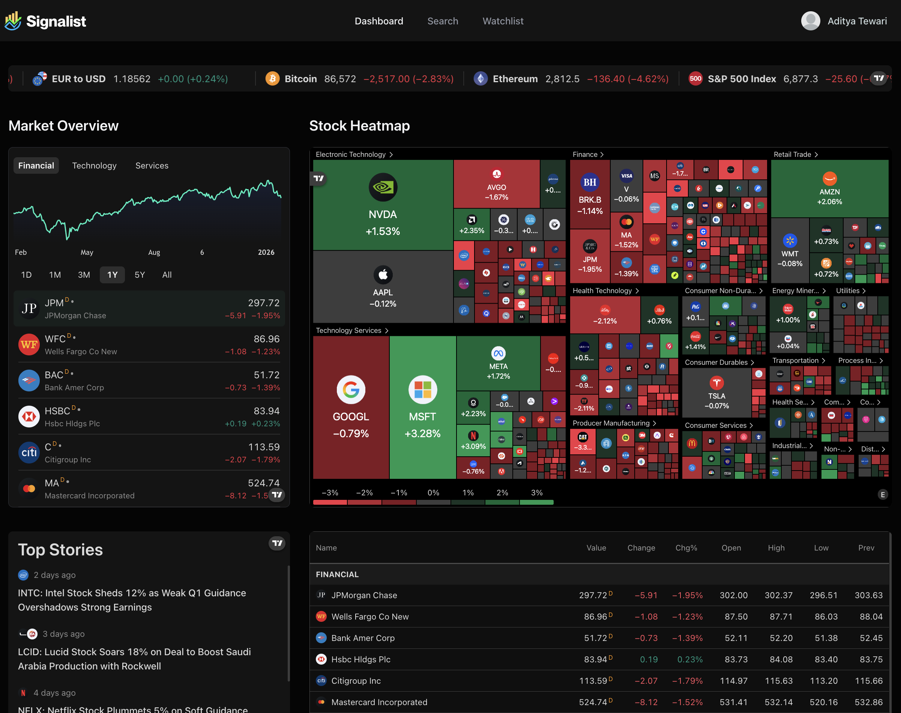
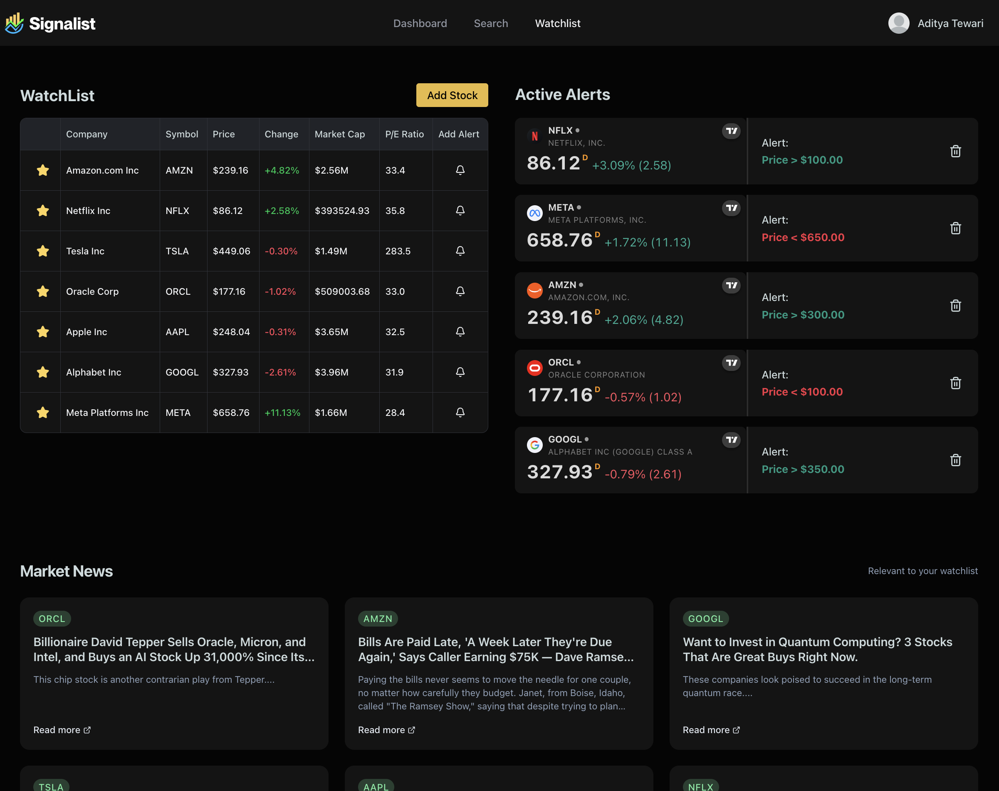
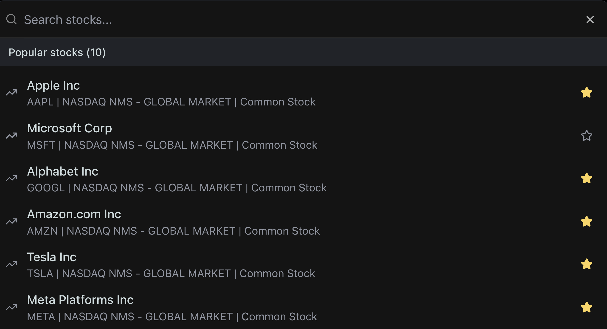
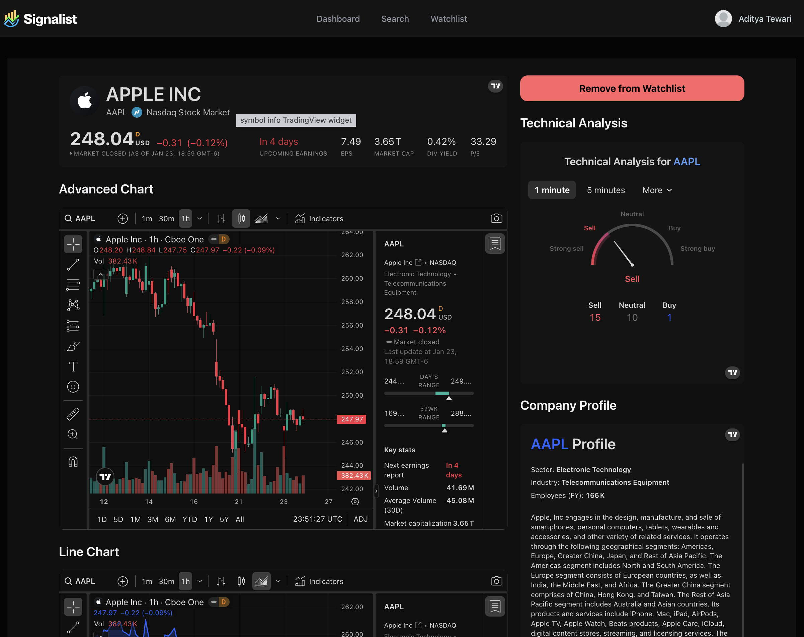

# Signalist

Signalist is a market intelligence app that combines real-time TradingView widgets, a personalized stock watchlist, price alerts, and AI‑generated daily news summaries. Users can search equities, track key metrics, and receive curated insights based on their watchlist.

This a personal project that was inspired by this [video](https://www.youtube.com/watch?v=gu4pafNCXng)

The app uses a Java SpringBoot backend which can be found [here](https://github.com/atewari0704/SignalistBackend)

This frontend is deployed on Vercel while the backend is deployed on Render. Render's free tier make the backend inactive if it doesn't get a request very frequently. If you do access the frontend via Vercel ut may take sometime for the backend on Render to be back up and running.

Here a few screenshots of what the app looks like

[Vercel Frontend](https://stock-tracker-app-pink.vercel.app/)
[Render Backend](https://signalistbackend.onrender.com)

### Dashboard 


### Alerts and Watchlist page


### Search


### Technical Analysis page



## Key Features

- Market dashboard with TradingView widgets (overview, heatmap, quotes, and top stories)
- Stock detail pages with advanced charts, technical analysis, financials, and company profile
- Watchlist management with fast search and add/remove flows
- Active price alerts with status tracking
- Daily email summaries powered by AI (Gemini)
- Authentication with personalized onboarding preferences

## Tech Stack

- Next.js 16 App Router, React 19, TypeScript
- Tailwind CSS + Radix UI components
- Better Auth + MongoDB for authentication and user data
- Finnhub for market news and profiles
- TradingView embeddable widgets
- Inngest for scheduled workflows
- Nodemailer for email delivery
- Spring Boot backend for watchlist and alerts (configurable via `BACKEND_URL`)

## Project Notes

- Watchlist and alert operations are proxied to a Spring Boot API (defaults to http://localhost:8080).
- Daily summaries run via Inngest cron and use Gemini to summarize news.
- For detailed watchlist flow and data model notes, see [WATCHLIST_SYSTEM.md](WATCHLIST_SYSTEM.md).

## Getting Started

1) Install dependencies

```bash
npm install
```

2) Create a .env.local file with the required variables (see below).

3) Start the app

```bash
npm run dev
```

Open http://localhost:3000 in your browser.

## Environment Variables

```env
# App
BACKEND_URL=http://localhost:8080

# Finnhub
NEXT_PUBLIC_FINNHUB_API_KEY=your_finnhub_key
FINNHUB_API_KEY=optional_server_key

# MongoDB
MONGODB_URI=your_mongodb_connection_string

# Nodemailer (Gmail)
NODEMAILER_EMAIL=your_email@gmail.com
NODEMAILER_PASSWORD=your_app_specific_password

# Inngest
INNGEST_EVENT_KEY=your_inngest_event_key

# Gemini AI
GEMINI_API_KEY=your_gemini_api_key

# Better Auth
BETTER_AUTH_SECRET=your_auth_secret
BETTER_AUTH_BASE_URL=your_base_url
```

## Scripts

- `npm run dev` – start dev server
- `npm run build` – production build
- `npm run start` – start production server
- `npm run lint` – lint
- `npm run test:db` – DB connectivity test
- `npm run migrate:watchlist` – migrate legacy watchlist documents

## Inngest Dev

```bash
npx inngest-cli@latest dev
```
